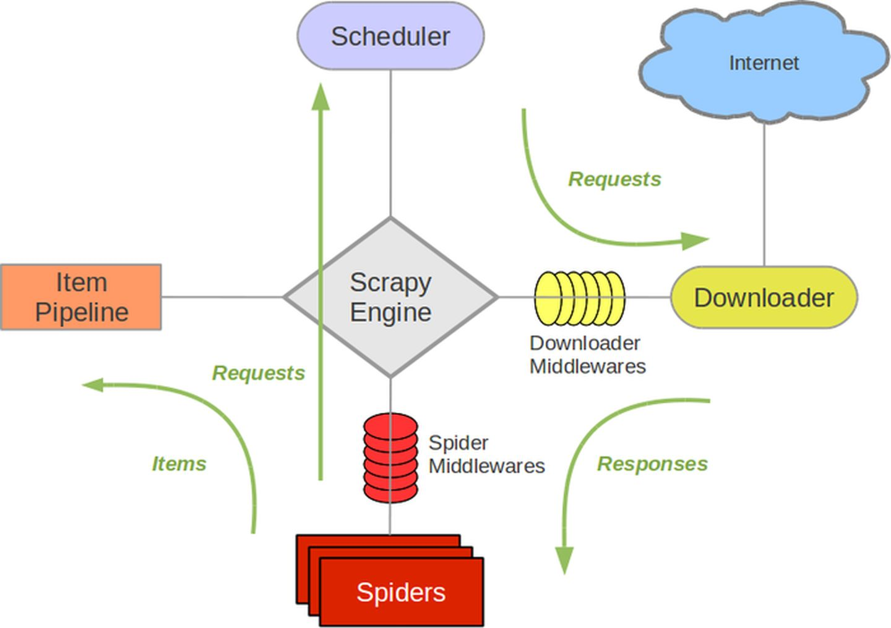

## Thief - 通用爬虫框架

#### 作者：蔡梓佳

---

### 简介

**Thief**作为公司自己研发的通用爬虫框架，主要为了帮助运营人员获取Website网站信息，收集数据和处理数据。

### 应用技术

Thief采用Python作为开发语言,基础框架则使用Python中的Scrapy爬虫框架作为实现。

#### 1.Scrap 的大致了解

Scrap整体架构图如下:

其流程可以描述如下：

* 调度器把requests >> 引擎 >> 下载中间件 >> 下载器。

* 下载器发送请求，获取响应 >> 下载中间件 >> 引擎 >> 爬虫中间件 >> 爬虫。
  

* 爬虫提取url地址，组装成request对象 >> 爬虫中间件 >> 引擎 >> 调度器。
  

* 爬虫提取数据 >> 引擎 >> 管道。
  

* 管道进行数据的处理和保存。

### Thief爬虫框架特性

* 支持HTTP接口
    
* 支持Xpath/JsonPath/css选择器进行数据解析提取。
  

* 支持自定义数据格式如：`{title:rule}`。
  

* 支持JSON/XML/二进制格式 。
  

* 数据源通过`RabbitMQ`进行读取,并实时转换。
  

* 支持爬取JS动态渲染(或ajax)的页面。

* 支持多种保存策略,如将数据保存在`File`,`Mysql`,`MongoDB`,`Redis`,`RabbitMQ`队列中。(目前只支持`RabbitMQ`)。

### 后续可能会支持的特性(当前版本没有)

* ~~常用字符串、日期、文件、加解密等函数~~
* ~~支持插件扩展(自定义执行器，自定义方法）~~
* ~~任务监控,任务日志~~
* ~~支持Cookie自动管理~~
* ~~支持自定义函数~~
* ~~支持自定义插件~~